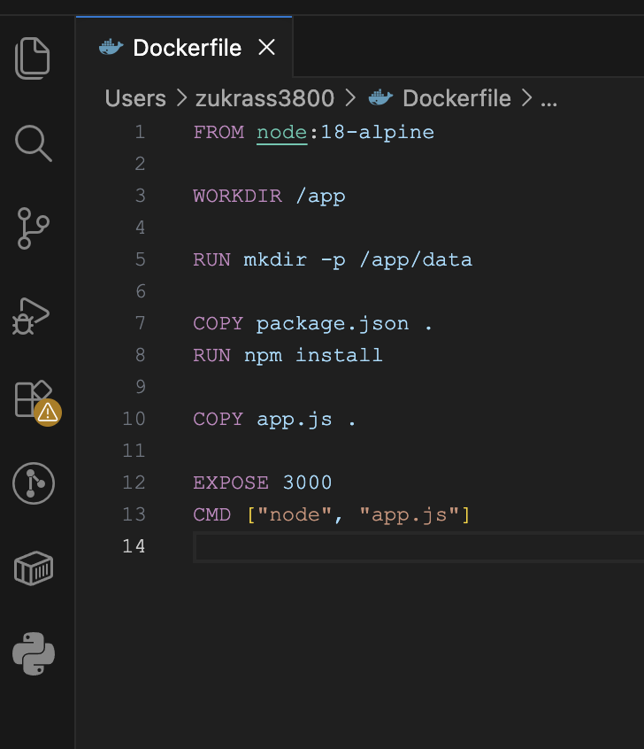
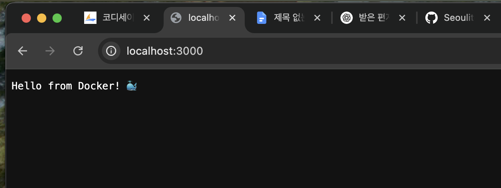
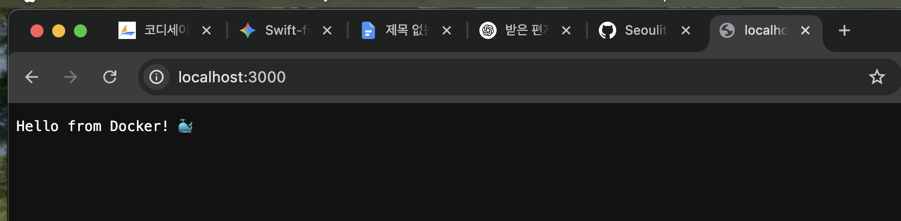
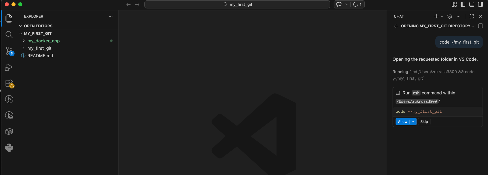
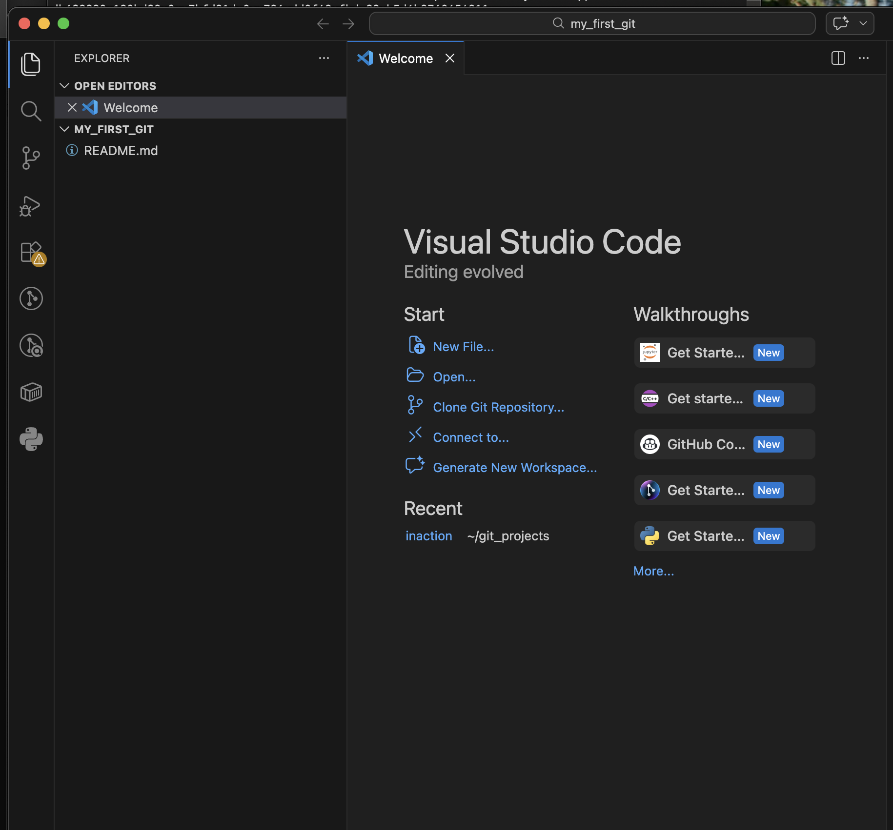
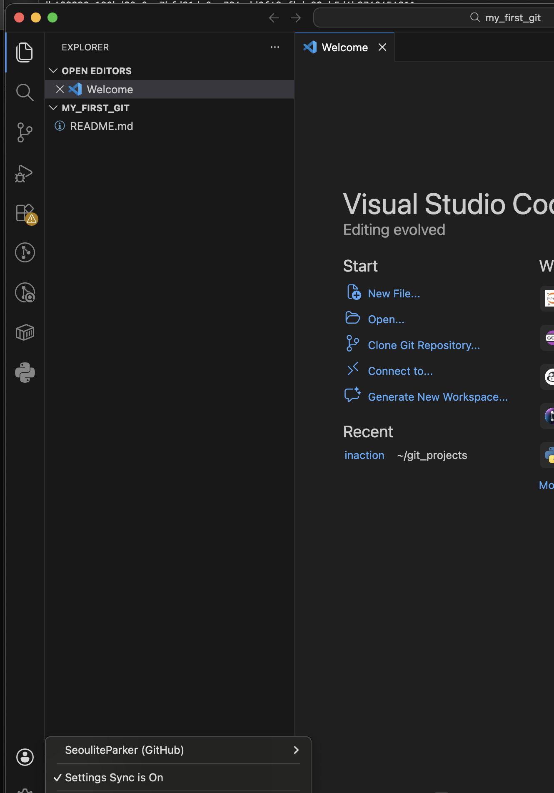

# 개발 워크스테이션 구축 (Dev Workstation Setup)

## 목차

0. [진행 타임라인](#0-진행-타임라인)
1. [개요 및 실행 환경](#1-개요-및-실행-환경)
2. [수행 체크리스트 & 검증 방법](#2-수행-체크리스트--검증-방법)
3. [터미널 조작 & 권한 실습](#3-터미널-조작--권한-실습)
4. [Docker 설치·점검·운영 명령](#4-docker-설치점검운영-명령)
5. [컨테이너 실행 실습 (hello-world / ubuntu)](#5-컨테이너-실행-실습-hello-world--ubuntu)
6. [Dockerfile 커스텀 이미지 + 포트 매핑 접속 증거](#6-dockerfile-커스텀-이미지--포트-매핑-접속-증거)
7. [바인드 마운트 & 볼륨 영속성 검증](#7-바인드-마운트--볼륨-영속성-검증)
8. [Git 설정 및 GitHub/VSCode 연동](#8-git-설정-및-githubvscode-연동)
9. [트러블슈팅](#9-트러블슈팅)
10. [보너스 과제 (선택)](#10-보너스-과제-선택)

---

## 0. 진행 타임라인

이 과제는 하루 만에 끝난 것이 아니라, 3일에 걸쳐 "시도 → 실패 → 원인 파악 → 재시도"를 반복하며 진행함. 최종 결과물만이 아니라 그 과정에서 각 설계가 왜 필요한지를 함께 확인했기 때문에, 진행 흐름을 아래에 기록함.

**1일차 — 터미널 기초 다지기**
`git_projects` 폴더 하나를 만들어 놓고 `pwd`/`ls -la`/`mkdir`/`touch`/`cp`/`mv`/`rm`부터 `chmod`까지 한 디렉토리 안에서 전부 실습함. 절대경로·상대경로로 같은 위치를 서로 다른 방식으로 이동해보고, `rm testfolder`가 "is a directory" 에러를 내는 것도 직접 겪어봄 (→ [3번](#3-터미널-조작--권한-실습)).

**2일차 — Git 첫 커밋과 Docker 첫 컨테이너**
`my_first_git` 폴더에서 `git init`부터 커밋·리네임·푸시까지 진행하다가 두 번 막힘: 로컬 브랜치가 `master`라 `push origin main`이 실패했고, GitHub가 HTTPS 비밀번호 인증을 막아둬서 Personal Access Token을 발급받아야 했음. 이 과정에서 토큰이 화면에 그대로 노출되는 실수가 있었음(→ 즉시 재발급 조치, [9번-3](#9-트러블슈팅)).
같은 날 OrbStack을 설치해 `my_docker_app`에 Node.js 웹 서버를 컨테이너로 띄우고, 포트 매핑과 바인드 마운트까지는 성공했지만 볼륨 영속성 테스트는 alpine 이미지에 `bash`가 없어서 실패한 채로 하루가 끝남 (→ [9번-4](#9-트러블슈팅)).

**3일차 — 미완료 항목 보완**
전날 실패했던 볼륨 테스트를 `sh`로 재시도해 완전히 성공시켰고, 빠져 있던 `docker info`/`docker stats`/`hello-world`/`ubuntu` 실습을 전부 채움. Dockerfile도 `node:20-alpine` → `node:18-alpine` + `RUN mkdir -p /app/data`로 다듬으면서 그 과정에서 `package.json` 파일을 만들기 전에 빌드부터 돌려서 또 한 번 에러를 겪음(→ [9번-5](#9-트러블슈팅)). 마지막으로 `git log`로 push가 실제로 반영됐는지 확인하고, VS Code에 GitHub 계정이 연동돼 있는 것도 스크린샷으로 남김.

---

## 1. 개요 및 실행 환경

- **미션 목표**: 터미널·Docker(OrbStack)·Git/GitHub를 직접 세팅하여, 팀원 누구나 동일하게 실행·배포·디버깅할 수 있는 재현 가능한 개발 워크스테이션을 구축한다.
- **저장소 링크**: https://github.com/SeouliteParker/my_first_git (원래 이름 `Codyssey`에서 변경됨)
- **구성**:

```
my_first_git/
├── README.md
├── Dockerfile
├── app/
│   ├── app.js
│   └── package.json
└── docs/
    └── images/
        ├── dockerfile-vscode_2.png
        ├── port-mapping-browser_3.png
        ├── port-mapping-browser-2_2.png
        ├── vscode-open-folder-structure_4.png
        ├── vscode-explorer-readme_2.png
        └── vscode-github-account_3.png
```

| OS | 아키텍처 | 쉘 | 컨테이너 런타임 | Docker | Git |
| --- | --- | --- | --- | --- | --- |
| macOS 15.7.7 (Sequoia) | x86_64 | zsh | OrbStack (orbctl 2.1.3) | 29.4.0 | 2.53.0 |

```bash
$ sw_vers
ProductName:            macOS
ProductVersion:         15.7.7
BuildVersion:           24G720

$ uname -m
x86_64

$ docker version
Client:
 Version:           29.4.0
 Context:           orbstack

$ git --version
git version 2.53.0
```

> **(서울캠퍼스) OrbStack 사용**: `sudo` 권한 제약으로 Docker Desktop 직접 설치 대신 OrbStack을 사용함. CLI 명령은 `orbstack`이 아니라 `orbctl`이며, `docker` 명령은 설치 후 그대로 사용 가능(`docker info`의 `Operating System: OrbStack`으로 확인됨). OrbStack은 macOS 위에 경량 리눅스 VM을 띄우고 그 안에서 Docker 데몬을 구동하는 방식이라, 사용자 입장에서는 `sudo` 없이 일반 사용자 권한만으로 `docker` 명령을 그대로 쓸 수 있음. 자세한 경위는 [9. 트러블슈팅 #1](#9-트러블슈팅) 참고.

**PC 종속 설정/경로 및 대체 방법**: 홈 디렉토리 경로가 `/Users/zukrass3800/...` 형태로 macOS 고유 경로임. 다른 macOS 환경에서는 계정명만 다르면 동일하게 재현 가능. Linux 환경이라면 `/home/<사용자명>` 경로로, OrbStack 대신 Docker Engine을 직접 설치한 환경이라면 `orbctl` 관련 언급만 건너뛰면 나머지 `docker` 명령은 동일하게 동작함.

---

## 2. 수행 체크리스트 & 검증 방법

- [x] 터미널 기본 조작 (위치/목록/이동/생성/복사/이름변경/삭제/내용확인/빈파일생성)
- [x] 파일·디렉토리 권한 변경 실습 (파일 1개, 디렉토리 1개)
- [x] Docker 버전 확인
- [x] Docker 데몬 점검 (`docker info`)
- [x] Docker 운영 명령 (`images`, `ps -a`, `logs`, `stats`)
- [x] `hello-world` 실행 성공
- [x] `ubuntu` 컨테이너 내부 진입·명령 수행
- [x] Dockerfile 작성 → 커스텀 이미지 빌드/실행
- [x] 포트 매핑 접속 성공 (curl + 브라우저 캡처 2회)
- [x] 바인드 마운트 반영 확인
- [x] 볼륨 영속성 확인 (삭제 전/후)
- [x] Git 설정 완료
- [x] GitHub push 성공 확인 (`origin/main` 동기화 확인)
- [x] VSCode GitHub 연동 캡처
- [x] 트러블슈팅 2건 이상 (6건 작성)
- [x] 민감정보 마스킹 확인

### 검증 방법 요약표

항목별로 **어떤 명령/방법으로**, **무엇을 근거로 "성공"이라고 판단했는지**, 그 증거가 어디 있는지를 정리함.

| # | 검증 대상 | 검증에 사용한 명령·방법 | 무엇을 보고 확인했나 | 증거 위치 |
| --- | --- | --- | --- | --- |
| 1 | 터미널 기본 조작 | `pwd`/`ls -la`/`mkdir`/`touch`/`cp`/`mv`/`rm`/`cat` | 각 명령 직후 `ls`/`pwd`/`cat` 재실행 결과로 파일·디렉토리 상태 변화가 명령과 일치하는지 확인 | [3번](#3-터미널-조작--권한-실습) |
| 2 | 파일 권한 변경 | `chmod 755 test.txt` 전후 `ls -l` | `-rw-r--r--`(644) → `-rwxr-xr-x`(755)로 실제 권한 문자열이 바뀐 것 | [3번 표](#3-터미널-조작--권한-실습) |
| 3 | 디렉토리 권한 변경 | `chmod 700 myfolder` 전후 `ls -la` | `drwxr-xr-x`(755) → `drwx------`(700)로 바뀐 것 | [3번 표](#3-터미널-조작--권한-실습) |
| 4 | Docker 버전 | `docker version` | `Client: Version: 29.4.0` 출력 | [1번](#1-개요-및-실행-환경), [4번](#4-docker-설치점검운영-명령) |
| 5 | Docker 데몬 동작 | `docker info` | `Server:` 블록이 정상 출력되고 `Containers`/`Images`/`OSType: linux` 등 실제 수치가 찍힘(데몬이 죽어있으면 이 블록 자체가 에러로 뜸 — [9번-6](#9-트러블슈팅)에서 실제로 그 실패 사례도 겪음) | [4번](#4-docker-설치점검운영-명령) |
| 6 | 이미지 목록 | `docker images` | `hello-world`, `node:20-alpine`, `my-node-app:1.0` 3개 이미지가 실제 목록에 존재 | [4번](#4-docker-설치점검운영-명령) |
| 7 | 컨테이너 목록(종료 포함) | `docker ps -a` | `hello-world`, `node:20-alpine` 컨테이너가 `Exited (0)` 상태로 목록에 남아있음 | [4번](#4-docker-설치점검운영-명령) |
| 8 | 컨테이너 로그 | `docker logs 0f480ef3051f` | 컨테이너 안에서 실행했던 `node --version`/`npm --version` 명령의 결과가 그대로 기록돼 있음 | [4번](#4-docker-설치점검운영-명령) |
| 9 | 리소스 사용량 | `docker stats --no-stream` | `stats-test` 컨테이너의 CPU %/MEM 사용량이 실제 수치(0.00%, 17.06MiB)로 출력됨 | [4번](#4-docker-설치점검운영-명령) |
| 10 | hello-world 실행 | `docker run hello-world` | "Hello from Docker!" 안내 메시지가 그대로 출력됨(클라이언트→데몬→이미지 pull 4단계 설명 포함) | [5번](#5-컨테이너-실행-실습-hello-world--ubuntu) |
| 11 | ubuntu 컨테이너 진입 | `docker run -it ubuntu bash` → `ls`, `echo "Hello Ubuntu"` | 리눅스 루트 디렉토리 목록과 `Hello Ubuntu` 출력이 실제로 컨테이너 프롬프트(`root@d2c0c0d698f5:/#`) 안에서 찍힘 | [5번](#5-컨테이너-실행-실습-hello-world--ubuntu) |
| 12 | 커스텀 이미지 빌드 | `docker build -t my-node-app:1.0 .` | `[+] Building ... (11/11) FINISHED`로 전 단계 성공, `docker images`에 새 이미지 등록 확인 | [6번](#6-dockerfile-커스텀-이미지--포트-매핑-접속-증거) |
| 13 | 포트 매핑 접속 | `curl http://localhost:3000` + 브라우저 접속(주소창 캡처, 서로 다른 시점 2회) | `curl` 응답과 브라우저 화면 둘 다 `Hello from Docker! 🐳` 텍스트가 뜸 | [6번](#6-dockerfile-커스텀-이미지--포트-매핑-접속-증거) |
| 14 | 바인드 마운트 반영 | 호스트 `data.txt` 수정 전/후 `docker exec bind-test cat /app/data/data.txt` | 재빌드·재시작 없이 컨테이너 안 `cat` 결과가 `Initial content` → `Modified content`로 즉시 바뀜 | [7번](#7-바인드-마운트--볼륨-영속성-검증) |
| 15 | 볼륨 영속성 | `volume-test` 삭제(`docker rm`) 후 `volume-test-2`를 같은 볼륨에 연결해 `cat important.txt` | 컨테이너를 완전히 지웠다가 새로 만들었는데도 이전에 쓴 `Important data from volume` 값이 그대로 읽힘 | [7번](#7-바인드-마운트--볼륨-영속성-검증) |
| 16 | Git 설정 | `git config --global user.name/user.email` 후 각각 재조회 | 설정한 값이 그대로 조회됨(`git config --list`) | [8번](#8-git-설정-및-githubvscode-연동) |
| 17 | GitHub push 성공 | `git status` + `git log --oneline` | `Your branch is up to date with 'origin/main'`, `git log`에서 `HEAD -> main`과 `origin/main`이 같은 커밋을 가리킴 | [8번](#8-git-설정-및-githubvscode-연동) |
| 18 | VSCode-GitHub 연동 | VS Code 좌하단 계정 메뉴 스크린샷 | `SeouliteParker (GitHub)` 계정이 연결돼 있고 `Settings Sync is On` 표시 | [8번 스크린샷](#8-git-설정-및-githubvscode-연동) |

---

## 3. 터미널 조작 & 권한 실습

```bash
$ cd git_projects
$ touch test.txt
$ ls -l
-rw-r--r--  1 zukrass3800  zukrass3800  0 Jul 28 14:21 test.txt

$ chmod 755 test.txt
$ ls -l
-rwxr-xr-x  1 zukrass3800  zukrass3800  0 Jul 28 14:21 test.txt

$ mkdir myfolder
$ ls -la
drwxr-xr-x   5 zukrass3800  zukrass3800  160 Jul 28 14:31 .
drwxr-x---+ 18 zukrass3800  zukrass3800  576 Jul 28 13:22 ..
drwxr-xr-x   4 zukrass3800  zukrass3800  128 Jul 28 10:52 inaction
drwxr-xr-x   2 zukrass3800  zukrass3800   64 Jul 28 14:31 myfolder
-rwxr-xr-x   1 zukrass3800  zukrass3800    0 Jul 28 14:21 test.txt

$ chmod 700 myfolder
$ ls -la
drwx------   2 zukrass3800  zukrass3800   64 Jul 28 14:31 myfolder   # 나머지 항목 동일

# 절대경로 vs 상대경로
$ cd myfolder
$ pwd
/Users/zukrass3800/git_projects/myfolder
$ cd ..                                  # 상대경로 이동
$ pwd
/Users/zukrass3800/git_projects
$ cd /Users/zukrass3800/git_projects/myfolder   # 절대경로 이동 (같은 곳으로 도착)
$ pwd
/Users/zukrass3800/git_projects/myfolder
$ ls ..                                  # 상대경로로 부모 디렉토리 조회
inaction  myfolder  test.txt

# 내용 확인 / 복사 / 이름변경 / 삭제
$ cd ..
$ cat test.txt
$ echo Hello > test.txt
$ cat test.txt
Hello
$ cp test.txt test2.txt
$ cat test2.txt
Hello
$ mv test2.txt hello.txt
$ mv hello.txt myfolder
$ ls myfolder
hello.txt

$ touch delete-me.txt
$ rm delete-me.txt

$ mkdir testfolder
$ rm testfolder
rm: testfolder: is a directory
$ rmdir testfolder
$ ls
inaction  myfolder  test.txt
```

| 대상 | 변경 전 | 명령 | 변경 후 |
| --- | --- | --- | --- |
| `test.txt` (파일) | `-rw-r--r--` (644) | `chmod 755 test.txt` | `-rwxr-xr-x` (755) |
| `myfolder` (디렉토리) | `drwxr-xr-x` (755) | `chmod 700 myfolder` | `drwx------` (700) |

**절대경로 vs 상대경로**

절대경로는 항상 루트(`/`)부터 시작해서 지금 내가 어디 있든 목적지가 정확히 하나로 고정되는 경로이고, 상대경로는 "지금 내가 서 있는 위치"를 기준으로 목적지를 표현하는 경로임. 위 로그에서:

- `cd ..` — 상대경로. 지금 위치가 `myfolder`면 부모인 `git_projects`로 가고, 다른 폴더에 있었다면 다른 곳으로 감(같은 명령이지만 결과가 위치에 따라 달라짐).
- `cd /Users/zukrass3800/git_projects/myfolder` — 절대경로. 내가 어디서 이 명령을 치든 항상 같은 폴더로 이동함(실제로 위 로그처럼 `git_projects`에서 쳐도, 다른 디렉토리에서 쳐도 결과는 동일).

즉 스크립트나 자동화 도구에는 절대경로가 안전하고, 사람이 손으로 이동할 때는 상대경로가 타이핑이 짧아 편리함.

**r/w/x 권한과 755·644 해석**

`ls -l`의 첫 칸(`-rwxr-xr-x` 같은 10자리)은 [파일종류 1자리] + [소유자 3자리] + [그룹 3자리] + [기타 3자리]로 구성됨. 각 3자리는 r(읽기)=4, w(쓰기)=2, x(실행/디렉토리 진입)=1의 합으로 숫자 하나가 됨.

- **755** = `rwxr-xr-x` → 소유자는 읽기·쓰기·실행 다 가능(4+2+1=7), 그룹과 기타는 읽기·실행만 가능(4+0+1=5). 실행 파일이나 "남들도 열어볼 수는 있지만 수정은 못 하게" 할 디렉토리에 자주 씀.
- **644** = `rw-r--r--` → 소유자만 쓰기 가능(4+2+0=6), 그룹·기타는 읽기만(4+0+0=4). 일반 문서/설정 파일에 흔한 기본값.
- 디렉토리에서 `x`는 "그 디렉토리 **안으로 들어가거나 안의 파일 목록에 접근**할 수 있는 권한"을 뜻하며, 파일의 `x`("실행 가능")와는 의미가 다름. 위 로그에서 `myfolder`를 `chmod 700`(`drwx------`)으로 바꾸면 소유자 본인만 그 폴더에 들어갈 수 있고 그룹·기타는 아예 접근이 막힘.

---

## 4. Docker 설치·점검·운영 명령

```bash
$ docker version
Client:
 Version:           29.4.0
 Context:           orbstack

$ docker info
Client:
 Version:    29.4.0
 Context:    orbstack
Server:
 Containers: 7
  Running: 1
  Paused: 0
  Stopped: 6
 Images: 3
 Server Version: 29.4.0
 Storage Driver: overlayfs
 Cgroup Driver: cgroupfs
 Cgroup Version: 2
 Kernel Version: 7.0.5-orbstack-00330-ge3df4e19b0a0-dirty
 Operating System: OrbStack
 OSType: linux
 Architecture: x86_64
 CPUs: 6
 Total Memory: 15.67GiB
 Name: orbstack

$ docker images
IMAGE                ID             DISK USAGE   CONTENT SIZE   EXTRA
hello-world:latest   c3cbe1cc1aa5       21.8kB         9.49kB    U
node:20-alpine       fb4cd12c85ee        192MB         48.8MB    U
my-node-app:1.0      7d89c2415638        192MB         48.4MB

$ docker ps -a
CONTAINER ID   IMAGE            COMMAND                  STATUS                      NAMES
0f480ef3051f   node:20-alpine   "docker-entrypoint.s…"   Exited (0) 9 minutes ago    amazing_bhaskara
4b9383685bb1   hello-world      "/hello"                 Exited (0) 12 minutes ago   sweet_tharp

$ docker logs 0f480ef3051f
/ # node --version
v20.20.2
/ # npm --version
10.8.2
/ # exit

$ docker stats --no-stream
CONTAINER ID   NAME         CPU %   MEM USAGE / LIMIT     MEM %   NET I/O         BLOCK I/O        PIDS
37d15a0c555b   stats-test   0.00%   17.06MiB / 15.67GiB   0.11%   1.66kB / 126B   86.4MB / 4.1kB   18
```

- **`docker ps` vs `docker ps -a`**: 위 목록은 `-a`로 조회한 것으로, 이미 종료(Exited)된 컨테이너까지 모두 보여줌. 옵션 없는 `docker ps`는 현재 실행 중인 컨테이너만 표시.
- **`docker info`가 알려주는 것**: 클라이언트뿐 아니라 데몬(Server) 상태까지 보여줌 — 실행 중인 컨테이너 수(1개), 전체 이미지 수(3개), 컨테이너 런타임이 리눅스 기반 OrbStack VM(`OSType: linux`)이라는 점을 확인할 수 있음. macOS는 리눅스 커널이 없기 때문에, Docker는 항상 이런 식으로 경량 리눅스 VM을 하나 띄워 그 안에서 컨테이너를 돌린다는 걸 실제 출력으로 확인한 셈.
- **`docker stats`가 알려주는 것**: 컨테이너별 CPU·메모리·네트워크·디스크 I/O를 실시간으로 보여줌. 위 예시에서 `stats-test` 컨테이너가 15.67GiB 중 17MB 남짓만 쓰고 있는 걸 보면, 컨테이너는 호스트 자원을 통째로 차지하는 게 아니라 필요한 만큼만 격리해서 쓴다는 걸 알 수 있음.

---

## 5. 컨테이너 실행 실습 (hello-world / ubuntu)

```bash
$ docker run hello-world
Hello from Docker!
This message shows that your installation appears to be working correctly.

To generate this message, Docker took the following steps:
 1. The Docker client contacted the Docker daemon.
 2. The Docker daemon pulled the "hello-world" image from the Docker Hub. (amd64)
 3. The Docker daemon created a new container from that image which runs the
    executable that produces the output you are currently reading.
 4. The Docker daemon streamed that output to the Docker client, which sent it
    to your terminal.

$ docker run -it ubuntu:latest /bin/bash
Unable to find image 'ubuntu:latest' locally
latest: Pulling from library/ubuntu
Status: Downloaded newer image for ubuntu:latest
root@d2c0c0d698f5:/# ls
bin  dev  home  lib64  mnt  proc  run   srv  tmp  var
boot etc  lib   media  opt  root  sbin  sys  usr
root@d2c0c0d698f5:/# echo "Hello Ubuntu"
Hello Ubuntu
root@d2c0c0d698f5:/# exit
exit
```

`hello-world` 출력의 4단계 설명이 그대로 Docker의 핵심 동작 원리임: **클라이언트(내 터미널의 `docker` 명령) → 데몬(백그라운드에서 실제로 컨테이너를 관리하는 프로세스) → 이미지 저장소(Docker Hub)**가 서로 분리되어 있고, 이미지가 로컬에 없으면 자동으로 받아온다는 것. `ubuntu` 실습에서도 `Unable to find image 'ubuntu:latest' locally` → `Pulling from library/ubuntu`로 같은 흐름이 반복됨.

**attach vs exec, 종료/유지 차이**

- `docker run -it ubuntu bash`는 **완전히 새 컨테이너**를 만들면서 그 컨테이너의 메인 프로세스(`bash`)에 곧바로 접속하는 방식. 위 로그처럼 `exit`로 나가면 메인 프로세스가 끝나버려서 **컨테이너 자체도 함께 종료(Exited)** 됨.
- `docker exec <실행중인 컨테이너> <명령>`(아래 7번의 `docker exec bind-test cat ...`, `docker exec volume-test sh -c ...` 등)은 **이미 떠 있는 컨테이너 안에서 별도의 프로세스만 잠깐 실행**하는 것. 명령이 끝나거나 셸에서 나가도 컨테이너의 메인 프로세스(예: `node app.js`)는 계속 살아있고, 컨테이너도 계속 실행 상태로 유지됨.
- 정리하면: `run -it`는 "새 컨테이너를 만들고 그 생명줄에 접속", `exec`는 "이미 살아있는 컨테이너에 잠깐 들어갔다 나오기". 컨테이너를 계속 띄워둔 채로 상태를 확인하고 싶다면 `exec`를, 완전히 새로 하나 만들어서 써보고 싶다면 `run -it`를 쓰면 됨.

---

## 6. Dockerfile 커스텀 이미지 + 포트 매핑 접속 증거

**방식**: (B) Linux 베이스 이미지(`node:18-alpine`) + 애플리케이션 실행 환경 구성
**베이스 이미지·선택 이유**: `node:18-alpine` — Node.js 런타임이 이미 포함되어 있고, alpine 기반이라 이미지 용량이 작음(불필요한 OS 패키지를 걷어낸 경량 리눅스라 빌드·배포가 빠름)

```dockerfile
FROM node:18-alpine
WORKDIR /app
RUN mkdir -p /app/data
COPY app/package.json .
RUN npm install
COPY app/app.js .
EXPOSE 3000
CMD ["node", "app.js"]
```



**웹 서버 소스코드**

```json
// package.json
{"name": "my-node-app", "version": "1.0.0", "main": "app.js"}
```

```js
// app.js
const http = require('http');
const server = http.createServer((req, res) => {
  res.writeHead(200, { 'Content-Type': 'text/plain; charset=utf-8' });
  res.end('Hello from Docker! 🐳\n');
});
server.listen(3000, () => {
  console.log('Server running on http://localhost:3000');
});
```

| 커스텀 포인트 | 목적 |
| --- | --- |
| `WORKDIR /app` | 컨테이너 내 작업 디렉토리를 고정해 파일 경로를 명확히 함 |
| `RUN mkdir -p /app/data` | 이후 바인드 마운트/볼륨으로 연결할 데이터 디렉토리를 빌드 시점에 미리 생성 |
| `COPY app/package.json .` / `COPY app/app.js .` | 호스트의 앱 소스(`app/` 폴더)를 이미지에 반영 |
| `RUN npm install` | 빌드 시점에 의존성을 설치해 실행 시 추가 설치가 필요 없게 함 |
| `EXPOSE 3000` | 컨테이너가 사용하는 포트를 문서화 |
| `CMD ["node", "app.js"]` | 컨테이너 시작 시 실행할 기본 명령 지정 (`package.json`에 `start` 스크립트가 없어 `npm start` 대신 직접 지정 — [9. 트러블슈팅 #5](#9-트러블슈팅)) |

```bash
$ docker build -t my-node-app:1.0 .
[+] Building 10.1s (11/11) FINISHED
 => [1/6] FROM docker.io/library/node:18-alpine
 => [2/6] WORKDIR /app
 => [3/6] RUN mkdir -p /app/data
 => [4/6] COPY app/package.json .
 => [5/6] RUN npm install
 => [6/6] COPY app/app.js .
 => exporting to image
 => => naming to docker.io/library/my-node-app:1.0

$ docker run -d -p 3000:3000 --name my-running-app my-node-app:1.0
fba0ad5def82...

$ curl http://localhost:3000
Hello from Docker! 🐳
```

**포트 매핑 접속 (서로 다른 시점 2회)**

```bash
$ docker run -d --name web-app -p 3000:3000 my-node-app:1.0
docker: Error response from daemon: ... Bind for 0.0.0.0:3000 failed: port is already allocated
$ docker rm -f web-app
$ docker run -d --name web-app -p 8080:3000 my-node-app:1.0   # 다른 호스트 포트로 재시도 → 성공
```

1차 접속 (주소창 `localhost:3000` + 응답):



2차 접속 — 다른 시점, 다른 브라우저 탭 구성에서 재확인:



- **커스텀 이미지란**: `node:18-alpine`이라는 기존 공식 이미지를 베이스로, `RUN`으로 필요한 디렉토리를 만들고 `COPY`로 내 애플리케이션 코드를 얹어 나만의 실행 이미지(`my-node-app:1.0`)를 만든 것. 즉 "이미지를 처음부터 새로 만드는 것"이 아니라 "이미 검증된 공식 이미지 위에 내 코드와 설정만 얹는" 방식이라, 베이스 이미지가 제공하는 Node.js 런타임·리눅스 환경은 그대로 재사용하면서 필요한 부분만 커스터마이징하는 게 핵심.
- **포트 매핑이 필요한 이유**: 컨테이너는 기본적으로 호스트와 분리된 자체 네트워크 네임스페이스를 가져서, 컨테이너 안에서 3000번 포트로 서버가 떠 있어도 호스트(내 macOS)에서는 그 포트가 보이지 않음. `-p <host>:<container>`로 호스트 포트와 컨테이너 포트를 연결해야 비로소 `curl http://localhost:3000`처럼 호스트에서 접속할 수 있음 — 실제로 위 로그·스크린샷 2장 모두 이 매핑이 있었기 때문에 접속에 성공한 것이고, 포트 충돌 트러블슈팅에서도 매핑된 호스트 포트가 겹치면 아예 컨테이너 실행 자체가 거부된다는 걸 확인함.

---

## 7. 바인드 마운트 & 볼륨 영속성 검증

### 바인드 마운트 (성공)

```bash
$ mkdir -p ~/docker-test/bind-mount
$ echo "Initial content" > ~/docker-test/bind-mount/data.txt
$ docker run -d --name bind-test -v ~/docker-test/bind-mount:/app/data -p 3001:3000 my-node-app:1.0
$ docker exec bind-test cat /app/data/data.txt
Initial content

# 호스트 파일 수정
$ echo "Modified content" > ~/docker-test/bind-mount/data.txt
$ docker exec bind-test cat /app/data/data.txt
Modified content
```

→ 이미지 재빌드나 컨테이너 재시작 없이, 호스트 파일 수정이 컨테이너 안에 곧바로 반영됨을 확인. 이건 개발 중에 코드를 고칠 때마다 이미지를 다시 빌드하지 않아도 되게 해주는 방식이라 개발 단계에서 특히 유용함.

### 볼륨 영속성 (성공)

```bash
$ docker volume create my-app-volume
my-app-volume

$ docker run -d --name volume-test -v my-app-volume:/app/data -p 3002:3000 my-node-app:1.0
$ docker exec volume-test sh -c 'echo "Important data from volume" > /app/data/important.txt'
$ docker exec volume-test cat /app/data/important.txt
Important data from volume

# 컨테이너 삭제
$ docker stop volume-test
$ docker rm volume-test

# 같은 볼륨을 새 컨테이너에 연결해서 확인
$ docker run -d --name volume-test-2 -v my-app-volume:/app/data -p 3003:3000 my-node-app:1.0
$ docker exec volume-test-2 cat /app/data/important.txt
Important data from volume
```

→ `volume-test` 컨테이너를 완전히 삭제(`docker rm`)한 뒤 새 컨테이너 `volume-test-2`를 같은 볼륨(`my-app-volume`)에 연결했는데도 데이터가 그대로 남아있음을 확인. (참고: 처음에는 `bash`로 시도해 실패했었고 `sh`로 재시도해 성공함 — [9. 트러블슈팅 #4](#9-트러블슈팅))

**바인드 마운트 vs 볼륨**

| 구분 | 바인드 마운트 | 볼륨 |
| --- | --- | --- |
| 저장 위치 | 호스트의 특정 경로(`~/docker-test/bind-mount`)를 그대로 사용 | Docker가 내부적으로 관리하는 별도 저장 공간(`my-app-volume`) |
| 접근성 | 호스트에서 파일 탐색기/에디터로 바로 열어볼 수 있음 | `docker volume inspect`나 컨테이너를 통해서만 접근 |
| 컨테이너 삭제 시 | 호스트 경로에 데이터가 그대로 남음(당연히 원본이 호스트에 있으니까) | Docker가 관리하는 영역에 남아있어서, 새 컨테이너를 같은 볼륨에 연결하면 다시 접근 가능(위 로그로 검증) |
| 주 사용 상황 | 개발 중 코드 실시간 반영 | DB 데이터처럼 컨테이너 생명주기와 무관하게 보존해야 하는 데이터 |

즉 컨테이너 자체는 "언제든 지우고 새로 만들 수 있는 일회용" 취급을 하는 게 Docker의 기본 철학인데, 그 안의 데이터까지 컨테이너와 함께 사라지면 곤란한 경우(로그, DB 등)를 위해 볼륨/바인드 마운트로 데이터를 컨테이너 생명주기 바깥에 분리해두는 것.

---

## 8. Git 설정 및 GitHub/VSCode 연동

```bash
$ git config --global user.name "zukrass3800"
$ git config --global user.email "zu*****@n***.com"     # 마스킹
$ git config --global user.name
zukrass3800
$ git config --global user.email
zu*****@n***.com

$ mkdir my_first_git && cd my_first_git
$ git init
Initialized empty Git repository in /Users/zukrass3800/my_first_git/.git/

$ echo "Hello Git" > READ.md
$ git add READ.md
$ git commit -m "Initial commit: Add README.md"
[master (root-commit) 5fdc615] Initial commit: Add README.md

$ mv READ.md README.md
$ git add .
$ git commit -m "Rename READ.md to README.md"
[master 533b319] Rename READ.md to README.md

$ git remote add origin https://github.com/SeouliteParker/Codyssey.git   # 이후 저장소 이름을 my_first_git으로 변경함
$ git branch -M main
$ git push -u origin main
remote: Invalid username or token. Password authentication is not supported for Git operations.
fatal: Authentication failed for 'https://github.com/SeouliteParker/Codyssey.git/'

$ git push -u origin main
Username for 'https://github.com': SeouliteParker
Password for 'https://SeouliteParker@github.com': ghp_************************  # ⚠️ 실제 토큰 노출됨 — 재발급 완료할 것

# 다음날 재확인
$ cd ~/my_first_git
$ git status
On branch main
Your branch is up to date with 'origin/main'.

$ git log --oneline
533b319 (HEAD -> main, origin/main) Rename READ.md to README.md
5fdc615 Initial commit: Add README.md
```

→ `Your branch is up to date with 'origin/main'`과 `git log`에 `origin/main`이 로컬 `HEAD`와 같은 커밋을 가리키는 것으로 **push가 정상적으로 성공했음을 확인**함.

> **보안 조치**: 위 과정에서 실제 GitHub Personal Access Token이 화면에 그대로 노출되는 실수가 있었음. HTTPS + PAT 자체는 정상적인 인증 방식이지만, 토큰 값이 문서에 노출된 시점에 해당 토큰을 폐기(revoke)하고 재발급함.

**VS Code로 저장소 열기**

터미널에서 `code ~/my_first_git`로 VS Code를 열었고, 탐색기(Explorer)에 `my_docker_app`(Docker 실습 폴더)과 `my_first_git`(Git 실습 폴더), `README.md`가 함께 보이는 것으로 두 실습을 같은 작업 공간에서 관리했음을 확인.





**다른 PC에서 재현하는 방법**: 위 방식(`code ~/my_first_git`)은 로컬에 저장소가 이미 있는 컴퓨터에서만 동작함. 로컬 폴더가 없는 다른 PC(공용PC 등)에서는 GitHub에서 직접 clone하여 여는 방식으로 동일하게 재현 가능함.

```bash
$ git clone https://github.com/SeouliteParker/my_first_git.git
$ cd my_first_git
$ code .
```

저장소가 공개(public)이므로 이 과정에는 VS Code에 GitHub 계정 로그인이 필요 없음. 계정 로그인은 `git push`처럼 저장소에 직접 쓰기 작업을 할 때만 요구됨.

**VSCode ↔ GitHub 연동**: VS Code 좌측 하단 계정 메뉴에 GitHub 계정이 연결되어 있고 Settings Sync가 켜져 있음을 확인.



**Git vs GitHub**

Git과 GitHub는 종종 같은 것처럼 취급되지만 역할이 다름:

- **Git**: 내 컴퓨터 안에서 파일이 어떻게 변해왔는지 기록하는 로컬 버전관리 도구. 위 로그의 `git init`(저장소 생성), `git add`(변경사항 스테이징), `git commit`(스냅샷 기록)까지는 전부 인터넷 연결 없이 내 컴퓨터 안에서만 일어나는 일임.
- **GitHub**: 그렇게 만들어진 Git 저장소를 원격 서버에 올려서 다른 사람과 공유·협업할 수 있게 해주는 **플랫폼**(회사/서비스). `git remote add origin ...`으로 "원격 저장소가 어디인지" 등록하고, `git push`로 로컬 커밋을 그 원격 저장소에 실제로 전송하는 단계부터가 GitHub의 영역임.

즉 Git 없이 GitHub만 쓸 수도 없고(GitHub 자체가 Git 저장소를 호스팅하는 서비스니까), Git만 쓰고 GitHub 없이 로컬에서만 버전관리를 할 수도 있음(`git log`의 `origin/main` 표시가 바로 "로컬 Git 상태"와 "원격 GitHub 상태"가 동기화됐는지를 보여주는 지점).

---

## 9. 트러블슈팅

### 1) `orbstack` 명령어를 찾을 수 없음
- **문제**: `orbstack --version` 실행 시 `zsh: command not found: orbstack`
- **원인 가설**: OrbStack의 CLI 실행 파일명이 앱 이름과 다를 것으로 추정
- **확인**: `which orbctl` → `/usr/local/bin/orbctl` 확인
- **해결**: `orbctl version` 사용 → `Version: 2.1.3` 정상 출력 확인

### 2) `git push` 시 "src refspec main does not match any"
- **문제**: `git push origin main` 실행 시 `error: src refspec main does not match any`
- **원인 가설**: 로컬 기본 브랜치가 `main`이 아니라 `master`로 생성되어 있었음
- **확인**: `git branch` → `* master`만 존재
- **해결**: `git branch -M main`으로 브랜치명을 변경한 뒤 재푸시

### 3) HTTPS 비밀번호 인증 거부 및 토큰 노출
- **문제**: `git push` 시 `remote: Invalid username or token. Password authentication is not supported for Git operations.`
- **원인 가설**: GitHub가 HTTPS 계정 비밀번호 인증을 지원하지 않고 Personal Access Token(PAT) 입력을 요구함
- **확인**: 비밀번호 입력란에 PAT를 입력해야 정상 인증됨
- **해결/대안**: PAT 발급 후 사용 — 단, 이 과정에서 토큰이 로그에 그대로 캡처되어 노출됨. **재발급 완료**. (권장 대안: [보너스 10] SSH 키 방식을 쓰면 토큰이 터미널에 노출될 위험 자체가 줄어듦)

### 4) `docker exec`에서 "bash: executable file not found"
- **문제**: `docker exec volume-test bash -c '...'` 실행 시 `exec: "bash": executable file not found in $PATH`
- **원인 가설**: alpine 계열 이미지에는 기본적으로 `bash`가 없고 `sh`(BusyBox ash)만 포함됨
- **확인**: 같은 명령을 `sh -c`로 바꿔 실행하니 정상 동작
- **해결**: alpine 기반 이미지에서는 `bash` 대신 `sh` 사용 → 이후 볼륨 영속성 테스트를 `sh`로 재시도해 성공([7번](#7-바인드-마운트--볼륨-영속성-검증))

### 5) Dockerfile 빌드 시 `COPY package.json .` 실패
- **문제**: `docker build` 중 `ERROR: ... "/package.json": not found`
- **원인 가설**: `package.json`을 만들기 전에 먼저 빌드를 실행함
- **확인**: `echo '{"name": "my-node-app", ...}' > package.json`으로 파일 생성 후 재빌드하니 `11/11 FINISHED`로 성공
- **해결/대안**: 빌드 전 필요한 파일이 실제로 존재하는지 먼저 확인하는 습관화. 이때 새로 만든 `package.json`에는 `scripts.start`가 없어서, `CMD`도 `npm start` 대신 `["node", "app.js"]`로 직접 지정하도록 함께 수정함.

### 6) OrbStack 데몬 연결 끊김
- **문제**: `docker info`/`docker run` 실행 중 `failed to connect to the docker API at unix:///.../docker.sock ... no such file or directory`
- **원인 가설**: OrbStack 앱이 백그라운드에서 일시적으로 종료되었거나 재시작 중이었을 것으로 추정
- **확인**: 잠시 후 동일 명령을 재시도하니 정상 응답
- **해결/대안**: OrbStack 앱 상태를 확인하고 필요시 재실행 후 재시도

---

## 10. 보너스 과제 (선택)

- [ ] Compose 단일 서비스 / 멀티 컨테이너 + 통신 확인
- [ ] Compose 운영 명령 (`up`/`down`/`ps`/`logs`)
- [ ] 환경 변수로 포트/모드 주입
- [x] GitHub SSH 키 생성

### GitHub SSH 키 설정

```bash
$ cd ~/my_first_git
$ git log --oneline
95e09b4 (HEAD -> main, origin/main, origin/HEAD) 변경
62e42f5 불필요한 문구 삭제
5e3d6ff Update README
d359ed3 ADD new README
e08a308 Rename README.md to git
533b319 Rename READ.md to README.md
5fdc615 Initial commit: Add README.md

$ ls -la ~/.ssh/
total 8
drwxr-xr-x   3 zukrass3800  zukrass3800   96  8  1 08:40 .
drwxr-x---+ 23 zukrass3800  zukrass3800  736  8  1 14:44 ..
-rw-r--r--   1 zukrass3800  zukrass3800  210  8  1 08:40 config

$ ssh-keygen -t ed25519 -C "your_email@example.com"
Generating public/private ed25519 key pair.
Enter file in which to save the key (/Users/zukrass3800/.ssh/id_ed25519):
Enter passphrase for "/Users/zukrass3800/.ssh/id_ed25519" (empty for no passphrase):
Enter same passphrase again:
Your identification has been saved in /Users/zukrass3800/.ssh/id_ed25519
Your public key has been saved in /Users/zukrass3800/.ssh/id_ed25519.pub
The key fingerprint is:
SHA256:4lctugtmh1lGZVv4ddlS7Oe+6I8UBdbr/vj7hsI6mVI your_email@example.com

$ ls -la ~/.ssh
total 24
drwxr-xr-x   5 zukrass3800  zukrass3800  160  8  1 14:52 .
drwxr-x---+ 23 zukrass3800  zukrass3800  736  8  1 14:44 ..
-rw-r--r--   1 zukrass3800  zukrass3800  210  8  1 08:40 config
-rw-------   1 zukrass3800  zukrass3800  419  8  1 14:52 id_ed25519
-rw-r--r--   1 zukrass3800  zukrass3800  104  8  1 14:52 id_ed25519.pub

$ git remote -v
origin  https://github.com/SeouliteParker/my_first_git.git (fetch)
origin  https://github.com/SeouliteParker/my_first_git.git (push)
```

`ssh-keygen -t ed25519`로 개인키(`id_ed25519`)와 공개키(`id_ed25519.pub`) 한 쌍을 생성함. 개인키는 권한이 `-rw-------`(600)로 소유자만 읽고 쓸 수 있도록 제한되어 있고, 공개키는 `-rw-r--r--`(644)로 다른 사용자도 읽을 수 있음 — 이 차이가 SSH 키 방식의 핵심으로, 공개키는 GitHub 서버에 등록해 공유하고 개인키는 로컬 컴퓨터 밖으로 절대 유출되지 않아야 하는 구조임.

`git remote -v` 확인 결과 현재 origin은 아직 HTTPS 주소(`https://github.com/...`)로 남아있어, 이후 GitHub 계정 설정에 공개키(`id_ed25519.pub`)를 등록하고 `git remote set-url origin git@github.com:SeouliteParker/my_first_git.git`으로 전환하는 절차가 남아있음. HTTPS + PAT 방식은 [9번-3](#9-트러블슈팅)에서 겪은 것처럼 터미널에 토큰 값이 노출될 위험이 있는 반면, SSH 키 방식은 인증 정보가 키 파일 형태로 로컬에만 존재해 그런 노출 위험 자체가 구조적으로 줄어듦.
